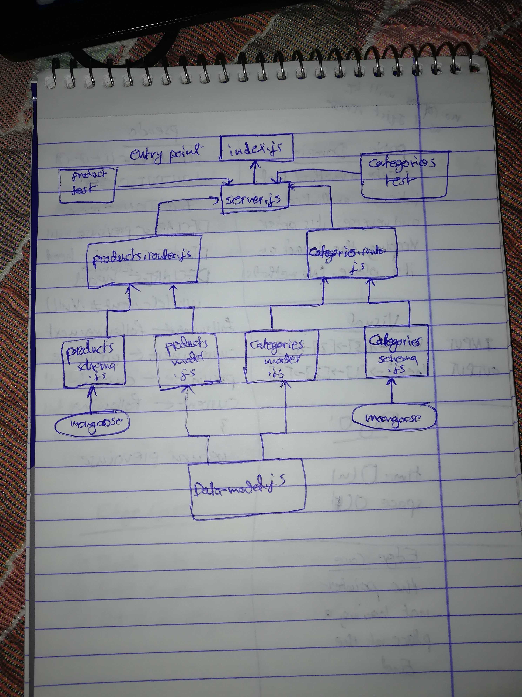

# LAB - Class 08

## Express Routing And Connected API

### Author: Ahmad K. Al-Mahasneh

### Links and Resources

- [submission PR](http://xyz.com)
- [ci/cd](http://xyz.com) (GitHub Actions)

#### `.env` requirements

- `PORT` - 3000
- `MONGODB_URI` - mongodb://localhost:27017/lab08db

#### How to initialize/run your application (where applicable)

- npm run start

#### Tests

- How do you run tests?
   npm run rest
- Any tests of note?
jest --verbose --coverage supergoose 

#### UML

